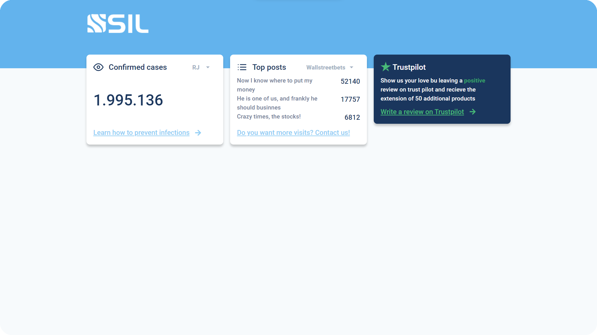
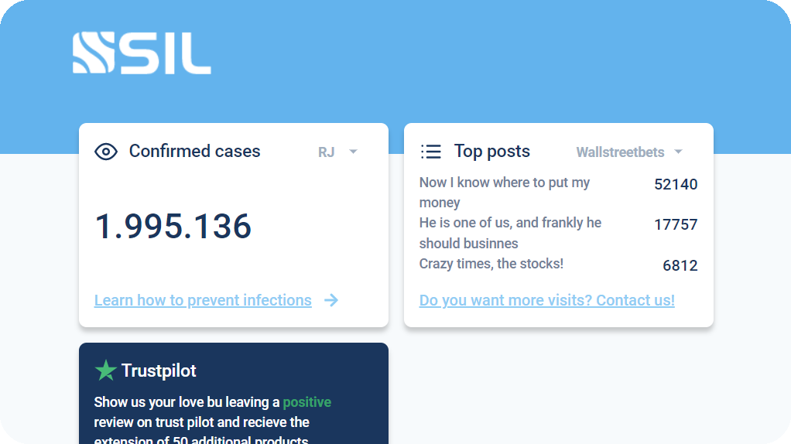
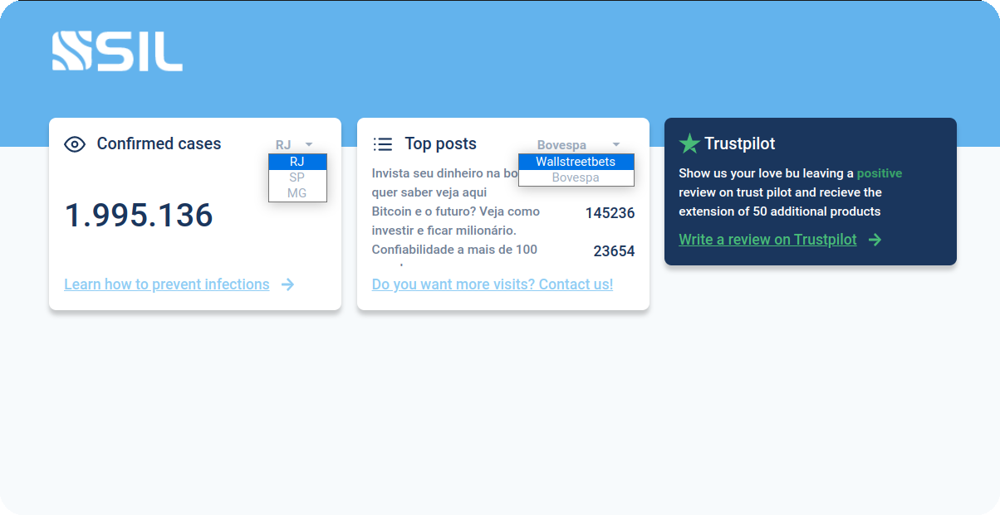
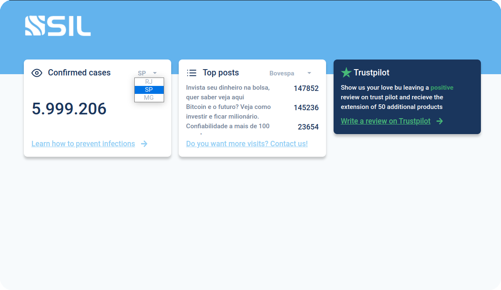
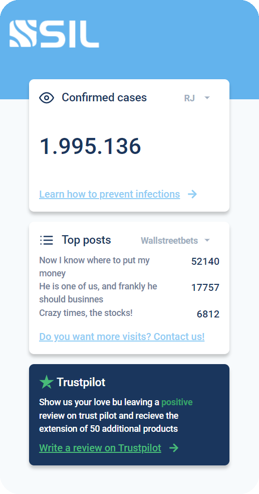
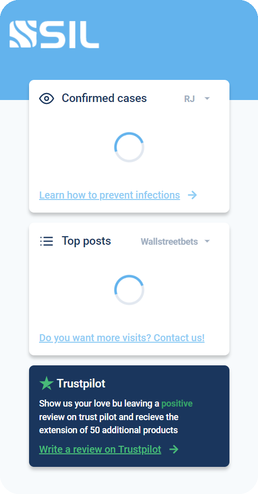
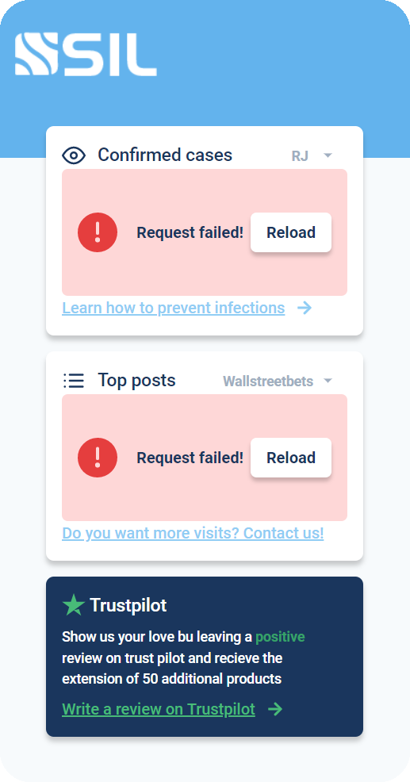

<h1 align="center">
  
<h3 align="center">
  Sil Cards, the best way to present information!.
</h3>

## Como rodar o projeto?

1. Ao clonar o projeto, Abra o terminal e navegue até a pasta raiz do projeto.
2. Execute o comando "pnpm install" para instalar as dependências do client.
3. Após instalar as dependências, inicie uma instância de terminal na pasta clonada e rode o banco de dados com o comando "pnpm db".
4. Abra outra instância de terminal na raiz e execute o comando "pnpm dev" para iniciar a aplicação. (Certifique-se de que o database está rodando).

## 📱 Preview 

  

## Vamos nos conectar?
- [Linkedin](https://www.linkedin.com/in/gabrielmalafaia/)

## 💇🏼 Sobre o template

Esse template faz parte de um desafio para testar a capacidade de implementar recursos e renderizar informações dinâmicas e estáticas em componentes reutilizáveis usando ReactJs como base.

Na pasta do projeto você encontrará a pasta `public` com o favicon e a pasta `src/assets` com o logotipo da empresa.

## 📸 Screenshots

Imagens da aplicação em operação, para ser utilizada como base.

## 🚀 Tecnologias requeridas

Tecnologias a serem utilizadas no desenvolvimento:

- [ReactJS](https://reactjs.org/) ou [NextJS](https://nextjs.org/docs)
- [MirageJS](https://miragejs.com/) ou [Json Server](https://github.com/typicode/json-server)
- [TypeScript](https://www.typescriptlang.org/)
- [Axios](https://github.com/axios/axios)
- [Chakra-UI](https://chakra-ui.com/) ou outra bilioteca de componentes
- [pnpm](https://pnpm.io/)
- [Bootstrap Icons](https://icons.getbootstrap.com/) (opcional)
- [Jest](https://jestjs.io/pt-BR/) ou [vitest](https://vitest.dev/) (opcional)

## 💻 Requisitos

- Para os dados utilizados, poderá se utilizar qualquer ferramente de geração de dados aleatórios, como sugestão o [mockaroo](https://mockaroo.com/) 
- Deve ser utilizado Pnpm com gerenciador de pacotes;
- Deve ser utilizado ReactJS ou NextJS;
- Deve ser utilizado, preferencialmente, a biblioteca de componentes Chakra-UI, no entanto poderá ser utilizado CSS ou alguma biblioteca ao seu gosto;
- Deve ser utilizada a biblioteca Axios para realizar requisições às APIs;
- O código deve ser totalmente em Typescript;
- A interface deve ser o mais similar possível as imagens apresentadas na seção de Screenshots;
- A componentização dos artefatos e o reaproveitamento dos mesmos deve ser ao máximo, obviamente utilizando o bom senso;
- As requisições devem compartilhar alguma lógica ao acessar diferentes endpoints;
- Deve ser utilizado o MirageJs ou Json-Server como mocked API, onde poderão trazer qualquer dado sobre casos de COVID-19, horário local, noticias etc;
- Os Selects nos dois primeiros cards, devem alterar algum parâmetro da requisição a API e atualizar os dados do corpo dos cards;
- O corpo do card deve possuir um loader (spinner) para quando houver requisição e deve desaparecer quando os dados já estiverem disponíveis;
- Caso a requisição falhe, deve ser mostrado um botão para fazer nova requisição;
- O projeto deve possuir tela responsiva, ou seja, versões para telas menores como tablets e celulares;
- Pequenas alterações no layout como ícones, fontes, textos, arredondamentos, sombras etc, não serão um problema;

## 📝 Sobre a avaliação

Será avaliado o seguinte:

- De caráter eliminatório, o código deve executar em sistemas Linux (caso utilize Windows a dica é desenvolver em WSL);
- Implementação dos requisitos;
- Reutilização dos componentes;
- Visual condizente com as imagens da secção de Screenshots;
- Indicadores visuais de carregamento de dados, loaders;
- Responsividade da tela;
- Código em inglês;
- Contarão como “extras” tratativa de erros, testes unitários e capacidade de de utilização de técnicas de otimização.

## 🚚️ Sobre a entrega

- Os commits de cada alteração devem ser feitos atomicamente e em inglês;
- No README da sua implementação deve estar descrito como instalar e executar o projeto, inclusive os teste, caso haja;
- O projeto deve ser subido em repositório próprio, deve estar público e seu link deverá ser enviado por e-mail para avaliação;
- O projeto deve ser entregue dentro do prazo estipulado;
# sil-cards-test
